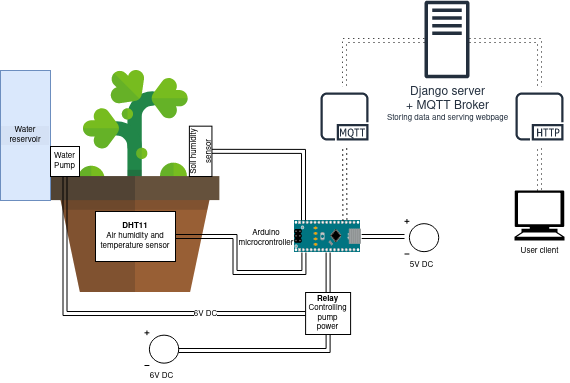
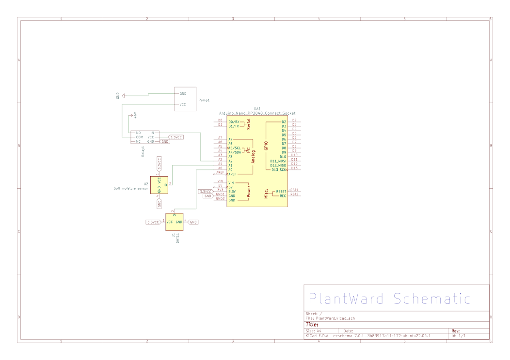

# PlantWard

The PlantWard project is comprised of two different parts.

1. The hardware system comprised of a DHT11 temperature and humidity sensor, a soil humidity sensor in addition a relay connected to a water pump. Which in part are connected to an Arduino RP2040.
2. A webserver hosting both a frontend and a mqtt broker.

### Project Architecture

### Hardware schematic

### Arduino Platform and Software

The code for the Arduino is written in Arduino IDE. It is stored locally and flashed to the Arduino. To get the wanted functionality we used the following libraries:
1. DHT.h: 
- A sensory library that provides an easy way to read the air temperature and air humidity from the DHT11 sensor.
2. WiFiNINA:
- To enable network connection with the Arduino. The library simplifies the process of configuring the WiFi module, connecting to a network and sending and receiving data over a wifi connection. 
3. ArduinoMqttClient:
- Enables clients to communicate with the MQTT brokers and publish or subscribe to MQTT topics. With this, clients can send or receive data over the internet, allowing for remote monitoring and control of devices.
