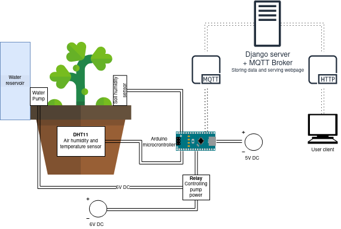
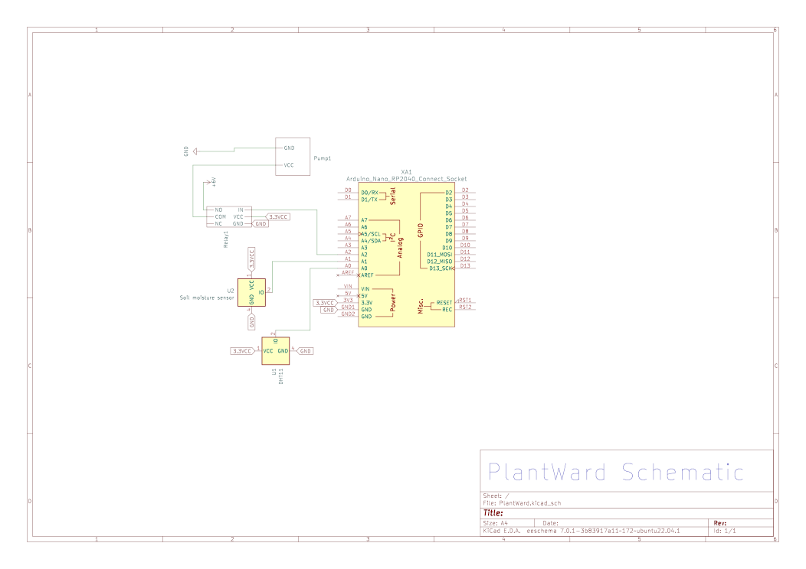
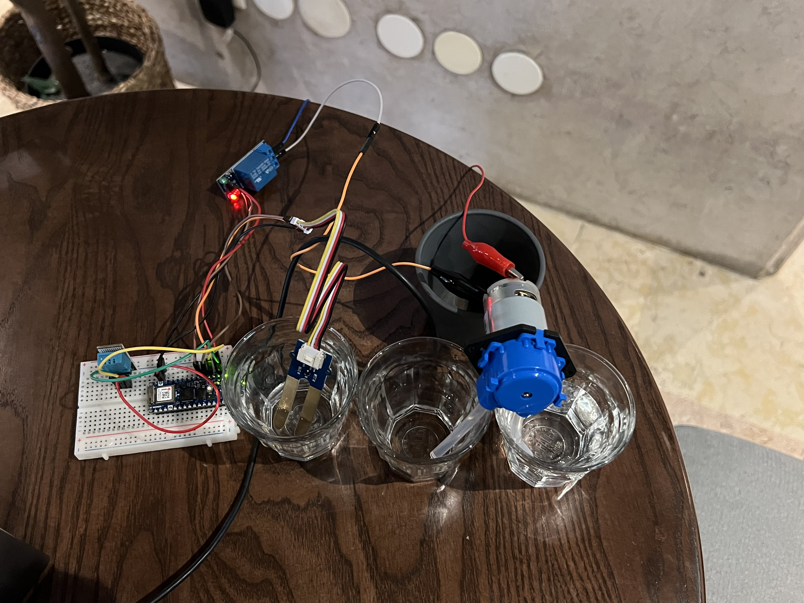
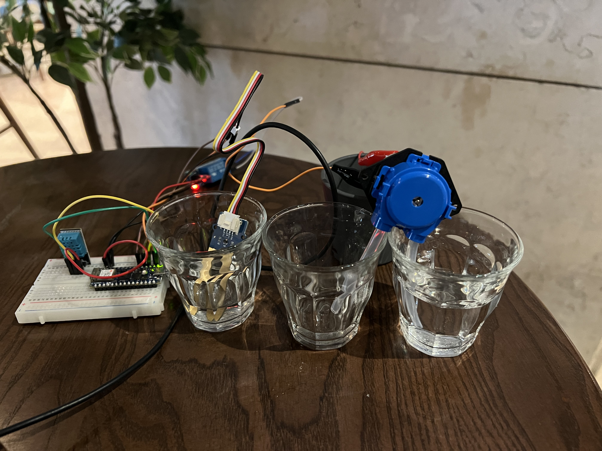

# PlantWard

The PlantWard project is comprised of two different parts.

1. The hardware system comprised of a DHT11 temperature and humidity sensor, a soil humidity sensor in addition a relay connected to a water pump. Which in part are connected to an Arduino RP2040.
2. A webserver hosting both a frontend and a mqtt broker.

### Project Architecture


### Hardware schematic


### Arduino Platform and Software

The code for the Arduino is written in Arduino IDE. It is stored locally and flashed to the Arduino. To get the wanted functionality we used the following libraries:
1. [ DHT.h ](https://www.arduino.cc/reference/en/libraries/dht-sensor-library/): 
- A sensory library that provides an easy way to read the air temperature and air humidity from the DHT11 sensor.
2. [ WiFiNINA ](https://github.com/arduino-libraries/WiFiNINA):
- To enable network connection with the Arduino. The library simplifies the process of configuring the WiFi module, connecting to a network and sending and receiving data over a wifi connection. 
3. [ ArduinoMqttClient ](https://github.com/arduino-libraries/ArduinoMqttClient):
- Enables clients to communicate with the MQTT brokers and publish or subscribe to MQTT topics. With this, clients can send or receive data over the internet, allowing for remote monitoring and control of devices.

### Webserver platform and software
The webserver is hosted using Ubuntu 20.04 and hosted using [ DigitalOcean ](https://www.digitalocean.com/).

The webserver needs [ python ](https://www.python.org/downloads/release/python-390/) 3.9.* in addition to other packages:
1. [ paho-mqtt ](https://pypi.org/project/paho-mqtt/) 1.6.1
2. [ Django ](https://pypi.org/project/Django/) 4.1.7

The broker used is [Mosquitto](https://mosquitto.org/download/) installed on the same instance as the Django server

To run the webserver all dependencies has to be installed and you have to run:

```
python manage.py makemigrations

python manage.py migrate

python manage.py runserver 0.0.0.0:80
```

A running webserver can be found [ here ](http://64.225.72.132/) on the server running at `64.225.72.132`. This is also the mqtt broker.

## Prototyp

This are the results of the current prototype:

1. The pump activates for 5 seconds when the soil humidity sensor detects a lower humidity than the threshold (shown [ here ](./resources/pump.mp4) by removing the sensor from the water) 
2. The pump activates after changing the threshold (show [here](./resources/threshold_change.mp4) by changing the level to something lover than possible)
3. Images of the prototype:
    - Top view
    
    - Side view
    